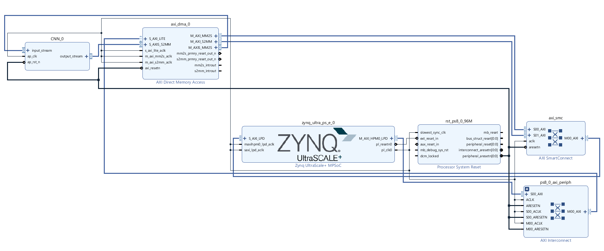

# AI subcomponent

## Model architecture
Input shape: (batch size, num_features, sequence len) = (128, 6, 60)\
There are two neural networks for glove and soccer with the same CNN architecture below:\
Layer 1.1 (convolutional layer): padding 0, kernel size 7, stride 1, number of filters 16, activation function relu\
Layer 1.2 (maxpool layer): padding 0, kernel size 2, stride 2\
Layer 2.1 (convolutional layer): padding 0, kernel size 5, stride 1, number of filters 32, activation function relu\
Layer 2.2 (maxpool layer): padding 0, kernel size 2, stride 2\
Layer 3.1 (convolutional layer): padding 0, kernel size 3, stride 1, number of filters 64, activation function relu\
Layer 3.2 (maxpool layer): padding 0, kernel size 2, stride 2\
Layer 4 (global average pooling): Take the average value for 64 features\
Layer 5 (MLP with dropout): input size 64, output size 64, activation function relu\
Layer 6 (MLP): input size 64, output size is the number of classes we want to predict. For glove it is 8 and for soccer it is 2\
Layer 7: Use softmax to predict the label 

## Hyperparameter tuning and result replication
Optuna is used for hyperparameter tuning. The random sampler is chosen to try different pairs of dropout_rate, num_epochs setting. The hyperparamers can be customized by changing the parameters of model class in model.py.

For glove training, due to the rush of the deadline, we don't have the null actions for val and test set. The parameters used for unseen player is extracted when training with dropout rate of 0.5 and num_epochs of 220 on Kaggle GPU P100.

For soccer training, we don't have the validation set. The parameters used for unseen player is extracted when training with dropout rate of 0.5 and num_epochs of 250 on Kaggle GPU P100.

## HLS conversion and generate the bitstream
1) The model is converted to HLS using the script in hls folder. Run "Solution -> Run C Synthesis" to systhesize the model and run "Solution -> Export RTL" to export the IP core.
2) Import IP core to vivado and stitch different IP cores together as shown below:

3) Create HDL wrapper and generate bitstream.
4) Export the bitstream and unzip the hdf file to get the bitstream file and hardware metadata file.
5) Transfer the bitstream file and hardware metadata file to the ultra96 board.

## Inference on Ultra96
1) Overlay the bitstream file on the FPGA.
2) Allocate the buffer and transfer the data to FPGA for inference.

## Reference
Cathalmccabe. (2023, December 22). Tutorial: PYNQ DMA (part 1: Hardware design). PYNQ. https://discuss.pynq.io/t/tutorial-pynq-dma-part-1-hardware-design/3133 

Cathalmccabe. (2021, October 13). Tutorial: PYNQ DMA (part 2: Using the DMA from PYNQ). PYNQ. https://discuss.pynq.io/t/tutorial-pynq-dma-part-2-using-the-dma-from-pynq/3134 

Spcl. (2021, November 14). Spcl/hls_tutorial_examples: Examples shown as part of the tutorial “productive parallel programming on FPGA with high-level synthesis”. GitHub. https://github.com/spcl/hls_tutorial_examples/tree/master?tab=readme-ov-file 

Hoefler, T., & Licht, J. de F. (2021, February 3). [Tutorial] Productive Parallel Programming for FPGA with High Level Synthesis. YouTube. https://www.youtube.com/watch?v=2UvUP2hxMyI 

Bourke, D. (n.d.). 02. pytorch neural network classification - Zero to mastery learn pytorch for deep learning. learnpytorch. https://www.learnpytorch.io/02_pytorch_classification/#8-putting-things-together-by-building-a-multi-class-pytorch-model 

Xilinx. (2021, August 19). Vitis-hls-introductory-examples/interface/streaming/using_axi_stream_with_side_channel_data/example_test.cpp at 2021.2 · Xilinx/
Vitis-HLS-introductory-examples. GitHub. https://github.com/Xilinx/Vitis-HLS-Introductory-Examples/blob/2021.2/Interface/Streaming/using_axi_stream_with_side_channel_data/example_test.cpp 

